# Roadmap

Where this project goes from here, in the order it should go there, with
the decision gates that could stop or redirect it.

`RESEARCH_PLAN.md` is the thesis narrative; `context/TODOS.md` is the
short-horizon checklist; this file is the medium-horizon plan that sits
between them — what happens after the current TODO list is empty, and
what would make it not happen.

**Current position:** Stages 0 → 2 complete and reproducible; Stage 3
fully wired but never executed. The next action is a spending decision,
not a coding one.

## Timeline

```mermaid
gantt
    title Roadmap from current position
    dateFormat X
    axisFormat %s
    section Now
    Stage 3 pilot (1 domain, few tasks)     :active, m1, 0, 1
    Correct cost model from pilot            :m2, after m1, 1
    section Next
    Stage 3 full sweep (3 domains x 5 agents):m3, after m2, 2
    Stage 3 analysis + writeup                :m4, after m3, 1
    Stage 5 interpretability on real data     :m5, after m3, 1
    section Then
    Calibrate A/B/C from real trajectories    :m6, after m4, 2
    Second benchmark (HiL-Bench)              :m7, after m4, 2
    section Finally
    Thesis writing                            :m8, after m5, 3
```

## Milestone 1 — Stage 3 pilot (immediate)

**Goal:** replace the cost model's placeholder assumptions with measured
ones, and confirm the integration survives contact with a real sweep.

- Run `run_stage3_smoke.py` — also re-verifies the router pre-training
  fix through the full tau2 import chain, which the cloud session that
  wrote it could not reach.
- Run one domain, a handful of tasks, one agent. Record: mean turns per
  task, escalation rate, real domain-policy token count.
- Feed those into `scripts/estimate_stage3_cost.py --avg-turns ...
  --escalation-rate ... --policy-tokens ...`.

**Gate:** if the corrected estimate is wildly above the ~$5 placeholder
(say >10x), reduce scope — one domain, fewer trials — rather than
proceeding at full width. A cheap sweep on retail alone still produces a
citable EFE-vs-baselines comparison.

## Milestone 2 — Stage 3 full sweep

**Goal:** the headline empirical result the thesis is built around: five
controllers, identical LLM, real benchmark tasks.

- `run_stage3_eval.py --domain retail` first, inspect, then widen.
- `analysis/stage3_report.py` turns the output into the comparison table.
- **Validate the raw-dump reader** (`enrich_from_raw_dump`) against the
  first real dump — it is written against an inferred schema and has
  never seen real tau2 output. Its escalation precision/recall numbers
  are not citable until this is done.

**Gate — the null-result branch:** if EFE lands within noise of the
baselines on task success, do *not* quietly reframe. `RESEARCH_PLAN.md`
§1 already commits to the fallback claim (EFE reproduces
value-of-information behavior without hand-derived per-domain utility
math), and Stage 2 Part 2 already found EFE and VOI genuinely diverge —
so the honest write-up is a trade-off characterization (EFE: escalation
recall; VOI: precision and reward), not a win claim. That result is
publishable given nobody has run this comparison before.

## Milestone 3 — Stage 5 interpretability on real data

**Goal:** the project's distinct methodological contribution.

The machinery is already built and tested (`analysis/interpretability.py`);
it has only ever run on synthetic logs. On real sweep logs it answers the
question that matters: **did the epistemic term ever actually change a
decision?**

**Gate — the uncomfortable one:** if `decisions_driven_by_epistemic` is
~0 on real data, then EFE behaved as a goal-seeking controller with extra
machinery, and the active-inference framing is decorative for this task
class. The report already flags this case explicitly rather than burying
it. That finding would need to lead the write-up, not be a footnote — and
it would sharpen rather than sink the thesis, since "the epistemic term
doesn't earn its keep in tool-agent orchestration" is itself a result
nobody has published.

**Early signal, worth knowing before the sweep:** run against the
repo's existing `results/stage2_decision_log.jsonl` (mock agent, 8 EFE
decisions), the analysis reports **0/8 decisions driven by the epistemic
term** — epistemic share of the decision signal ~0.065, with the
pragmatic term dominating. That is a *tiny, non-real-task sample* and
proves nothing on its own: the mock agent's scripted observations are
unusually unambiguous, which is exactly the regime where information
gain has least to offer. But it means this gate is live rather than
hypothetical, and it is worth checking on the first real pilot's logs
(Milestone 1) rather than waiting for the full sweep — if the epistemic
term is still inert on real, genuinely ambiguous tasks, that reshapes
the thesis and it is much cheaper to learn at pilot scale.

## Milestone 4 — Calibration (the biggest open scientific gap)

Every probability in `efe_controller.py` is hand-specified and
structurally reasonable, not fitted (`docs/efe-control-node-design.md`
is explicit about this). Real sweep trajectories are the first data that
could fix that:

- Fit `OBS_DISTS` from observed (hidden-state-proxy, observation) pairs.
- Fit `B_TRANSITIONS` from observed policy → outcome transitions.
- Re-run Stage 2 Part 2 and Stage 3 with calibrated matrices; report
  both, since the delta between hand-specified and calibrated is itself
  informative about how much the framing depends on tuning.

**Why this is not first:** calibration needs trajectories, and
trajectories need a sweep. Doing it earlier would mean fitting to the
model-matched simulator, which is circular — the simulator samples from
the very matrices being fitted.

## Milestone 5 — Second benchmark (generalization)

One benchmark is one benchmark. HiL-Bench (`arXiv:2604.09408`) is the
most on-target second one, since its Ask-F1 metric measures exactly the
selective-escalation behavior this project's controllers differ on.

- First step is cheap and unblocked today: check whether HiL-Bench has a
  public code/data release at all. If not, GAIA's validation subset is
  the fallback (`RESEARCH_PLAN.md` Stage 4).

## Milestone 6 — Write-up

Materials that already exist and shouldn't be regenerated: the stage
result docs, `docs/known-issues-and-gotchas.md` (a genuinely unusual
methods-section asset — most papers can't show their own bug archaeology),
and the architecture docs.

## Deferred, with reasons

| Item | Why not now |
|---|---|
| OTel GenAI spans replacing JSONL logs | Needs a collector/backend; the JSONL already carries everything Stage 5 reads, so this is ops polish, not a research blocker |
| `hand_off_to_agent` as a real multi-agent route | Currently a steering hint only; needs a second specialized agent to hand off *to*, which is a separate build |
| Richer OPA policies (refunds, cancellations) | The `.rego` file is the right place and extends cleanly, but tau2's irreversible actions should be exercised by a real sweep first so the policy is written against observed behavior |
| Angle B (predictive-coding memory vs RAG) | `RESEARCH_PLAN.md` explicitly scopes this as a second paper, not a dependency — pursue only if Stage 3 finishes early |
| Anthropic-native client + prompt caching | Would meaningfully cut sweep cost (the domain policy is resent on every call, uncached) — worth revisiting if the corrected cost model makes the sweep expensive |

## Standing rules

1. **Reproducibility before results.** `scripts/run_full_pipeline.py`
   must stay green; a stage that stops reproducing invalidates whatever
   it was cited for.
2. **Say which comparison a number came from.** The Stage 2 Part 1 vs
   Part 2 split exists because a plumbing check and a decision-quality
   result look identical in a table and mean completely different things.
3. **Bugs go in the archive.** `docs/known-issues-and-gotchas.md` has
   caught the same class of error recurring (silent misreads that
   produce plausible wrong decisions) — that pattern is worth tracking,
   and it is thesis material.
