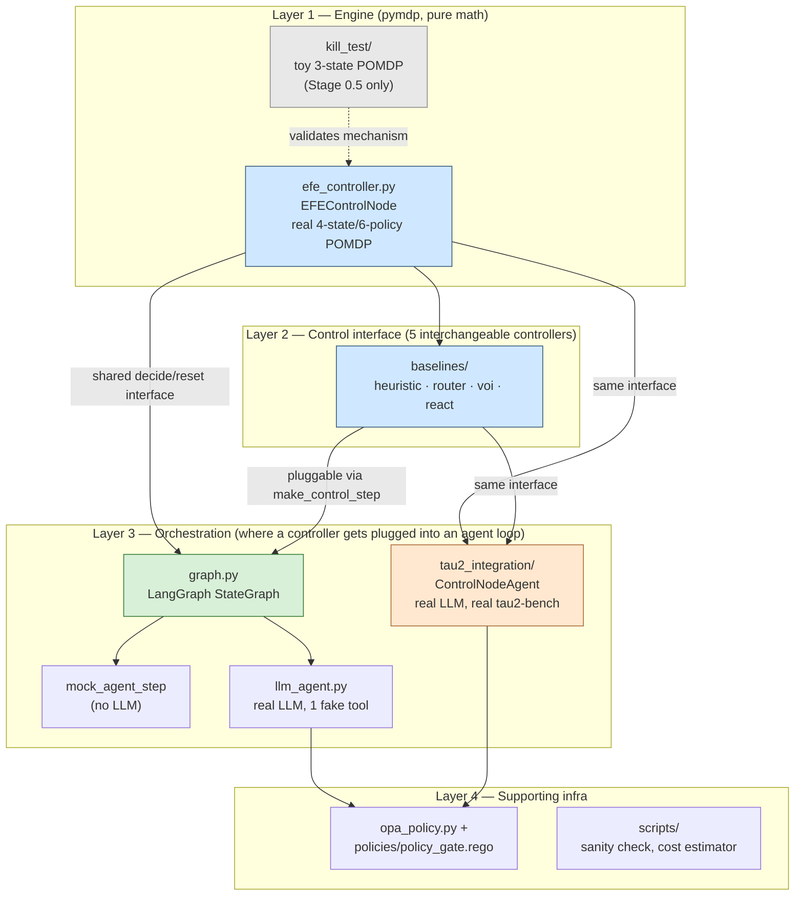

# Architecture overview

How the pieces of this repo fit together, top to bottom. Read this first;
the other `docs/*.md` files each zoom into one layer.

## Layers

The system is four layers, each one reusable independently of the layers
above it — this is deliberate, not incidental: it's what let Stage 0.5's
kill-test validate the core mechanism for pennies before any LangGraph or
tau2-bench code existed.



## What each layer actually is

**Layer 1 — Engine.** `efe_controller.py` is the only piece that talks to
pymdp directly. It implements the frozen decision-POMDP from
[`decision-pomdp.md`](decision-pomdp.md): 4 hidden task-state values, 4
observation modalities, 6 policies. `kill_test/` is a separate, smaller
toy POMDP (3 states, 3 actions) that existed only to answer one question
cheaply before committing to the rest of the build — see
[`stage0.5-kill-test-results.md`](stage0.5-kill-test-results.md). It is
not reused by anything above it.

**Layer 2 — Control interface.** `EFEControlNode` and the four
`baselines/` controllers (`HeuristicControlNode`, `LearnedRouterControlNode`,
`VOIControlNode`, `ReActControlNode`) all implement the exact same
contract:

```python
class AnyControlNode:
    def __init__(self, prior=None): ...
    def reset(self, prior=None): ...
    def decide(self, observation: Observation, valid_policies=None) -> Decision
```

This is the single most load-bearing design decision in the codebase —
see [`baselines-design.md`](baselines-design.md). Every layer above this
one is generic over which controller it's driving.

**Layer 3 — Orchestration.** Two independent integrations plug controllers
into an actual agent loop:
- `graph.py` — a LangGraph `StateGraph`, driven by either `mock_agent_step`
  (no LLM, for proving plumbing) or `llm_agent_step` (real LLM via
  `llm_agent.py`, one fake tool). See [`langgraph-integration.md`](langgraph-integration.md).
- `tau2_integration/` — `ControlNodeAgent` wraps a controller inside
  tau2-bench's own `HalfDuplexAgent` contract, so it runs as a real agent
  in the actual benchmark (retail/airline/telecom domains, real tools,
  real `transfer_to_human_agents` scoring). See
  [`tau2-bench-integration.md`](tau2-bench-integration.md).

These two integrations do **not** share code with each other (LangGraph's
node/edge model and tau2's turn-based `generate_next_message` contract are
different enough that a shared abstraction wasn't worth building) — but
they derive the same 4 observation modalities the same conceptual way.
See [`observation-derivation.md`](observation-derivation.md).

**Layer 4 — Supporting infra.** `opa_policy.py` shells out to a real `opa
eval` per turn against `policies/policy_gate.rego` for the `policy_gate`
observation modality — used by both `llm_agent.py` and `tau2_integration/`
(not by `mock_agent_step`, which hardcodes `allow` since it has no real
tool-call history to check a retry policy against). `scripts/` holds
standalone tools: the Stage 0 pymdp sanity check, and the Stage 3 cost
estimator.

## Directory map

```
src/aif_orchestrator/
├── efe_controller.py          # Layer 1 — the real EFE engine
├── graph.py                   # Layer 3 — LangGraph wiring + mock agent
├── llm_agent.py                # Layer 3 — real LLM agent (demo/Stage 1c)
├── opa_policy.py                # Layer 4 — OPA wrapper
├── kill_test/                  # Layer 1 (standalone) — Stage 0.5
│   ├── env.py                   # toy 3-state environment
│   ├── controllers.py           # toy versions of all 5 controllers + Random
│   └── run_kill_test.py
├── baselines/                  # Layer 2 — the 4 non-EFE controllers
│   ├── belief.py                 # shared Bayes update + reward shaping
│   ├── heuristic.py / router.py / voi.py / react.py
│   ├── model_env.py              # model-matched simulator (Stage 2 Part 2)
│   ├── run_stage2_eval.py        # mock-agent comparison (Part 1)
│   └── run_model_matched_eval.py # model-matched comparison (Part 2, the real result)
└── tau2_integration/            # Layer 3 — real benchmark integration
    ├── efe_agent.py               # ControlNodeAgent (generic) + EFEAgent
    ├── baseline_agents.py         # HeuristicAgent/RouterAgent/VOIAgent/ReActAgent
    ├── register.py                 # registers all 5 with tau2's agent registry
    ├── run_stage3_smoke.py         # 1-task sanity check
    └── run_stage3_eval.py          # the real sweep

policies/policy_gate.rego       # Layer 4 — the actual OPA policy
scripts/                         # Layer 4 — standalone tools
docs/                             # you are here
context/                          # HANDOFF.md / TODOS.md — resume points
results/                          # committed: summaries. gitignored: raw dumps
```

## See also

- [`decision-pomdp.md`](decision-pomdp.md) — the frozen schema every layer implements
- [`efe-control-node-design.md`](efe-control-node-design.md) — Layer 1 deep dive
- [`baselines-design.md`](baselines-design.md) — Layer 2 deep dive
- [`langgraph-integration.md`](langgraph-integration.md) / [`tau2-bench-integration.md`](tau2-bench-integration.md) — Layer 3 deep dives
- [`experiment-pipeline.md`](experiment-pipeline.md) — the research stages this architecture was built to support, and their status
- [`known-issues-and-gotchas.md`](known-issues-and-gotchas.md) — every real bug caught while building this, consolidated
