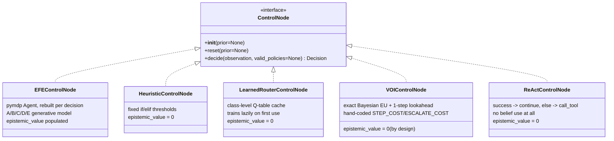
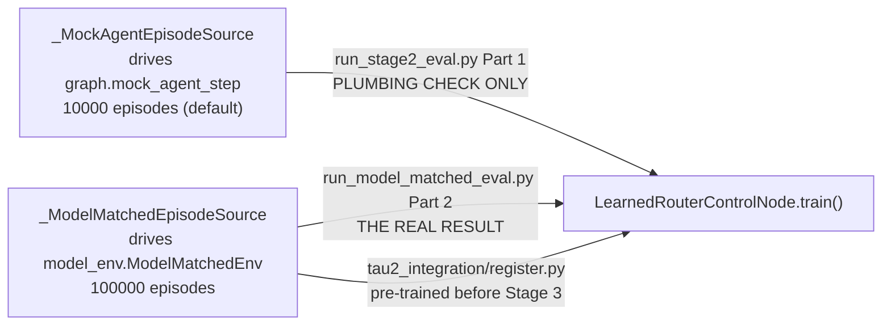

# Baselines design

Deep dive into `src/aif_orchestrator/baselines/` — the four controllers
EFE is actually being tested against. For *results*, see
[`stage2-baselines-results.md`](stage2-baselines-results.md) (read Part 2,
not Part 1). This file covers how they're built and why each one exists.

## The shared interface

This is the single most load-bearing design choice in the whole
codebase — every baseline is a drop-in replacement for `EFEControlNode`
anywhere in the system (`graph.py`, `tau2_integration/`), because all
five implement exactly the same contract:

```python
class AnyControlNode:
    def __init__(self, prior=None): ...
    def reset(self, prior=None): ...
    def decide(self, observation: Observation, valid_policies=None) -> Decision
```



Only `EFEControlNode` populates `epistemic_value` with anything nonzero —
that's the whole point of it being the thing under test, not a baseline.

## What mechanism each one uses to decide

| Controller | Mechanism | Uses belief? | Has an epistemic-value term? | Escalation cost model |
|---|---|---|---|---|
| `EFEControlNode` | pymdp Expected Free Energy | yes (drives the decision) | yes | `E` habits (soft prior) |
| `HeuristicControlNode` | fixed if/elif on the latest observation | tracked, not used | no | hard rule (`policy_gate == deny` → escalate) |
| `LearnedRouterControlNode` | tabular Q-learning, offline-trained | yes (a feature) | no | whatever the learned Q-values encode |
| `VOIControlNode` | exact Bayesian expected-utility + 1-step lookahead | yes (drives the decision) | **no, by design** | hand-coded `ESCALATE_COST` constant |
| `ReActControlNode` | reactive floor: success→continue, else→call_tool | no | no | none — never escalates |

`VOIControlNode` is the sharpest comparison point, not `HeuristicControlNode`
— it shares EFE's belief-Bayesian-update machinery and even reuses EFE's
own assumed observation model (`efe_controller.OBS_DISTS`/`B_TRANSITIONS`,
via `belief.py`), differing *only* in that it has no epistemic-value term
and no habits mechanism, just explicit hand-derived formulas. This is
deliberate: per the Stage 0.5 kill-test's finding, if EFE can't
distinguish itself from VOI, the active-inference framing isn't earning
anything beyond what hand-derived decision theory already gets for free
(see `RESEARCH_PLAN.md` §1's "sharpened secondary question").

## `belief.py`: the shared plumbing, and two real bugs it fixed

All four baselines import `bayes_update` and `uniform_decision` (or
`step_reward` for training) from `belief.py` rather than each
reimplementing Bayesian updates — using **the same observation model EFE
itself assumes** (`efe_controller.OBS_DISTS`), so any behavioral gap is
about the *decision mechanism*, not about which controller happens to
have a better model of the world.

`step_reward` (used for the router's training signal and both
`run_stage2_eval.py`/`run_model_matched_eval.py`'s scoring) exists
because two real bugs showed up during development:

1. **Reward-hacking via never terminating.** An early version paid the
   full C-weighted `observation_reward` on *every* turn, not just
   terminal ones. A controller that kept re-observing a good-looking
   state collected that reward indefinitely — the learned router
   converged to never choosing `continue` at all, since every extra turn
   was pure upside. Fixed: real payoff only on a genuine terminal turn
   (`continue`/`escalate_to_human` chosen, or turns exhausted); a flat
   `NONTERMINAL_STEP_COST` (-0.3) every other turn.
2. **No signal to prefer correct escalation over `continue`.** Even
   after fixing (1), nothing in the reward differentiated `continue` from
   `escalate_to_human` at the *same* observation — the router never
   learned escalation was ever the right call. Fixed: `OUTCOME_ADJUSTMENT`,
   a ground-truth-keyed bonus/penalty (`forced_bad` — whether the
   underlying task was genuinely unresolvable) applied only to the
   evaluation harness's/router's training reward, never fed to any
   controller's own `decide()` — same information asymmetry `kill_test/env.py`
   used (the environment knows the true state; controllers only ever see
   observations).

Both are documented in full in `belief.py`'s own docstring — this section
summarizes them because they're the kind of subtle, easy-to-reintroduce
bug worth knowing about before touching `belief.py` or `router.py` again.

## `VOIControlNode`'s lookahead, concretely

For the three "terminal-ish" policies (`continue`, `escalate_to_human` —
the two `graph.py`'s `route_from_decision` actually treats as exits),
VOI's value is just the expected C-weighted utility of the resulting
belief. For the info-seeking policies (`retry`/`call_tool`/`gather_info`/
`hand_off_to_agent`), it does a genuine one-step value-of-information
computation: transition the belief per that policy's `B_TRANSITIONS` row,
enumerate **all 144 joint observation bins** this decision-POMDP can
produce next turn (4 modalities × their bin counts — small enough to do
exactly, no sampling needed), Bayes-update per hypothetical observation,
and take the expected best-of-`{continue, escalate}` value. This mirrors
`kill_test.controllers.VOIController._eu_gather`, generalized from the
kill-test's single observation channel to the real system's 4.

## `LearnedRouterControlNode`'s belief-state-parity fix

The Stage 0.5 kill-test flagged a specific, real risk: comparing EFE
against a router whose features are only "the latest observation" isn't
a fair fight, because EFE/VOI integrate the *entire* observation history
into a running belief. `LearnedRouterControlNode`'s Q-table keys are
`(belief_bucket, observation)`, not `observation` alone —
`_belief_bucket()` reduces the running belief to `(argmax state, is it
≥60% confident)`, a coarse-but-real summary of accumulated history, not
just the most recent reading. This fix is applied uniformly; what still
varies between the two Stage 2 comparisons is **what the router trains
against**, not this — see the next section and
[`known-issues-and-gotchas.md`](known-issues-and-gotchas.md).

## Training data matters as much as the algorithm

`LearnedRouterControlNode.train()` is pluggable via `source_factory`:



The mock-trained router (Part 1) and the model-matched-trained router
(Part 2) are **different Q-tables** answering different questions — Part
1 validates plumbing, Part 2 is Stage 0.5's Bayes-optimality methodology
actually repeated at real scale, and is the one whose numbers should be
cited. `tau2_integration/register.py` explicitly pre-trains against the
model-matched source before any `RouterAgent` is constructed for exactly
this reason — without that, the real tau2-bench sweep's router baseline
would have silently regressed to the mock-trained (weaker, unfair-comparison)
Q-table. See [`known-issues-and-gotchas.md`](known-issues-and-gotchas.md)
for this as a caught-and-fixed item.

## `model_env.ModelMatchedEnv`: the real analogue of the kill-test's env

`kill_test/env.py` was Stage 0.5's ground truth — VOI and EFE both
reasoned over literally the same generative model the environment used to
generate observations. `model_env.py` is that same idea at the real
decision-POMDP's scale: it samples true state from `efe_controller.D_PRIOR`,
samples each observation modality independently from
`efe_controller.OBS_DISTS[true_state]`, and transitions state via
`efe_controller.B_TRANSITIONS[policy][true_state]`. Any gap Part 2 reveals
between controllers is genuinely about decision mechanism — not about who
happens to model `mock_agent_step`'s scripted quirks better.
