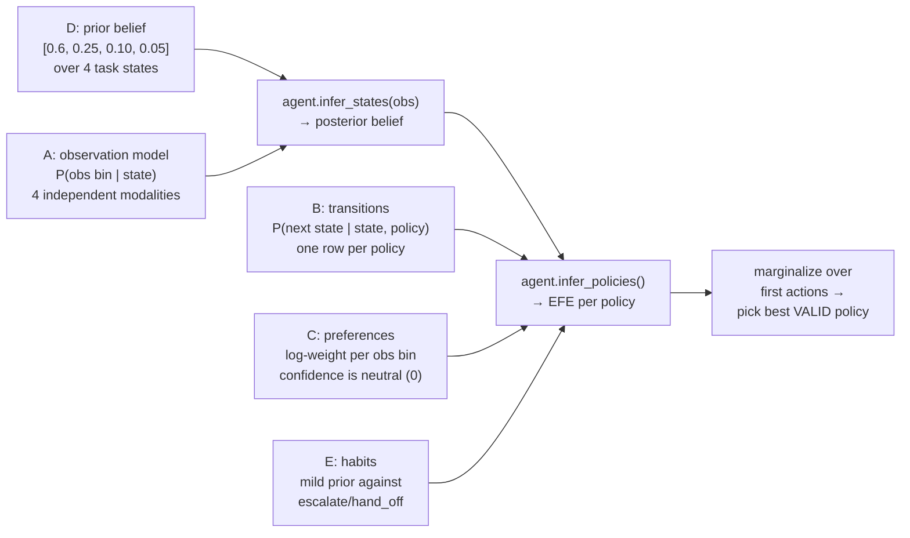

# EFE control node design

Deep dive into `src/aif_orchestrator/efe_controller.py` — the actual EFE
engine. For the decision space this implements, see
[`decision-pomdp.md`](decision-pomdp.md) (states/observations/policies
and why they're frozen). This file covers *how* the engine turns that
schema into a decision.

## The generative model, at a glance

pymdp needs five things: `A` (observations given state), `B` (state
transitions given policy), `C` (preferences over observations), `D`
(prior belief), and optionally `E` (prior over policies, aka habits).
`efe_controller.py` hand-specifies all five as module-level constants —
explicitly **not calibrated against real data**, matching the semantic
descriptions in `decision-pomdp.md`. Calibration is Stage 3+ work, once
real agent trajectories exist to calibrate against.

## Why `B` needed a fix (real bug, not hypothetical)

The first version of `B_TRANSITIONS` let every policy leave
`task_solvable_now` completely unchanged — including `retry`,
`call_tool`, and `gather_info`. Result: when belief was ~99% concentrated
on `task_solvable_now`, EFE was **completely indifferent** between
`continue` and `gather_info` (action marginals ~0.197 each) — there was
no signal in the model to prefer doing nothing over an unnecessary extra
step.

Fix: unnecessary info-seeking actions now carry a small, realistic risk
of nudging `task_solvable_now` toward `needs_more_info` (0.03 / 0.05 /
0.10 for retry / call_tool / gather_info respectively — an unnecessary
extra step can genuinely surface confusing or spurious signals, a real
failure mode). `continue` alone stays exactly risk-free. This is the kind
of bug that's easy to miss because the engine runs fine and produces *a*
decision either way — it just isn't the *right* decision. See
[`known-issues-and-gotchas.md`](known-issues-and-gotchas.md) for the full
list of bugs like this one.

## Epistemic vs. pragmatic decomposition

Every `Decision` carries both components per candidate policy, not just
the winning policy — this is what Stage 5's interpretability analysis
needs, and it's logged from day one (`decide()`'s docstring in the code
notes this explicitly). `_decompose_efe()` recomputes them directly via
`pymdp.legacy.control.calc_states_info_gain` /
`calc_expected_utility`, since the legacy `Agent` API doesn't expose the
split out of the box:

- **Epistemic value** — expected information gain about `task_state`
  from taking a policy. High for `gather_info` when belief is spread
  across states; near zero once belief is concentrated (there's nothing
  left to learn).
- **Pragmatic value** — expected log-preference (`C`-weighted) of the
  observations a policy is predicted to produce.

`action_marginals` (what actually gets acted on) comes from summing
`q_pi` — pymdp's posterior over policies, balancing both terms per its
own `gamma`/`alpha` precision parameters — grouped by first action, then
masked to `valid_policies` before taking the argmax. A policy that's
individually preferred but invalid this turn (e.g. `gather_info` after
`MAX_GATHERS`, in the kill-test's stricter cousin — the real
`efe_controller.py` doesn't cap gathers, but the interface supports
`valid_policies` for exactly this kind of runtime restriction) never gets
chosen even if its raw marginal is highest.

## One instance per decision, not one instance per conversation

`EFEControlNode.decide()` builds a **fresh** `pymdp.legacy.agent.Agent`
every call, seeded with the *running* belief as `D`. This is a deliberate
simplification, not an oversight: it avoids relying on pymdp's own
cross-timestep state propagation (`self.action`/`self.prev_obs`
bookkeeping), which is easy to get subtly wrong across many turns. The
belief itself *does* persist correctly across turns — it's threaded
through explicitly by the caller (`graph.py`'s `control_step`, or
`tau2_integration/efe_agent.py`'s `state.belief`) — only the pymdp
`Agent` object itself is rebuilt each time. Planning horizon is 1 step
(`policy_len=1`): the real system gets fresh observations every turn, so
it replans from scratch rather than committing to a multi-step plan in
advance, per `decision-pomdp.md`'s "Mapping to the LangGraph agent loop".

## Habits (`E`) as the escalation-cost mechanism

`decision-pomdp.md` calls for "a mild preference against reaching
`escalate_to_human` repeatedly" — but pymdp's `C` vector is defined over
*observations*, not policies, so a per-policy cost can't live there
directly. `E_WEIGHTS` (a prior over the 6 policies, not a hard rule) is
where this actually lives: `escalate_to_human` gets 0.5 and
`hand_off_to_agent` 0.6 against 1.0 for the other four, normalized to sum
to 1. This is a real, structural difference from the `VOIControlNode`
baseline, which has no habits mechanism and instead hand-codes an
`ESCALATE_COST` constant directly into its expected-utility formula — see
[`baselines-design.md`](baselines-design.md) for why that contrast is the
point of having VOI as a baseline at all.

## Where the numbers come from (and their honesty limits)

Every probability in `TOOL_RESULT_DIST` / `CONFIDENCE_DIST` /
`POLICY_GATE_DIST` / `RETRIEVAL_QUALITY_DIST` / `B_TRANSITIONS` is
hand-picked to be *structurally reasonable* — ordinally correct (e.g.
`needs_human` really should produce low confidence more often than
`task_solvable_now` does), not empirically fit. `baselines/model_env.py`
(the Stage 2 Part 2 simulator) treats these same numbers as ground truth
— which is honest for a same-model-assumptions comparison between
controllers, but is **not** a claim that these numbers match real agent
behavior. Calibrating them against real tau2-bench trajectories is
explicitly out of scope until Stage 3 produces data to calibrate against.
