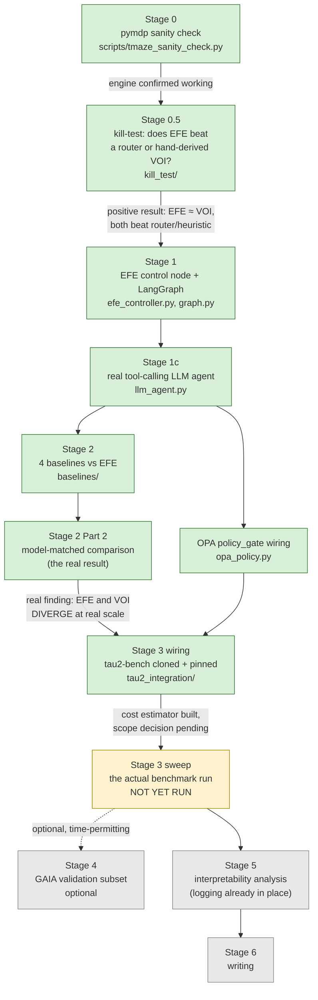

# Experiment pipeline

The research stages this codebase implements, and their current status.
`RESEARCH_PLAN.md` is the authoritative narrative (thesis statement,
literature framing, risks); this document is the visual map of how the
stages chain together and what each one produced. `context/TODOS.md` is
the actionable checklist; this is the "how do the pieces connect" view.

## Pipeline

Green = done and verified. Yellow = wiring done, execution pending (a
scope/budget decision, not a coding task). Gray = not started.

## Why the pipeline bends the way it does

The shape here isn't a fixed plan executed top-to-bottom — it's the
result of two explicit gate decisions along the way, both driven by
external review rather than the original schedule:

1. **Stage 0.5 was inserted after Stage 0**, not originally planned. An
   external review of the initial plan asked the sharpest possible
   question — *"what does EFE give you that a good learned router
   doesn't?"* — and the response was to build a cheap, 1-2 week kill-test
   *before* committing to the full LangGraph/benchmark build, not after.
   See `RESEARCH_PLAN.md` §4a and [`stage0.5-kill-test-results.md`](stage0.5-kill-test-results.md).
2. **Stage 2 got a second pass (Part 2)** after the first pass's own
   result exposed its own weakness: comparing every controller against
   `mock_agent_step` validated plumbing but wasn't a real repeat of Stage
   0.5's Bayes-optimality methodology. `model_env.ModelMatchedEnv` closed
   that gap, and the result changed materially — see
   [`stage2-baselines-results.md`](stage2-baselines-results.md) and
   [`baselines-design.md`](baselines-design.md).

Both are the same discipline applied twice: don't trust a result until
the comparison is actually fair, and say so explicitly when an earlier
result wasn't.

## What each stage actually produced

| Stage | Deliverable | Where |
|---|---|---|
| 0 | Working pymdp engine, confirmed to reproduce the classic epistemic-value effect | `scripts/tmaze_sanity_check.py`, `results/stage0_tmaze_sanity_check.json` |
| 0.5 | EFE ≈ hand-derived VOI (statistically indistinguishable), both beat heuristic/router with real significance | `docs/stage0.5-kill-test-results.md`, `results/stage0_5_kill_test_results.json` |
| 1 | EFE control node over the real decision-POMDP; LangGraph wiring incl. working `interrupt()` human-review pause | `docs/efe-control-node-design.md`, `docs/langgraph-integration.md` |
| 1c | Real tool-calling LLM agent step (demo-scale) | `docs/observation-derivation.md` |
| 2 (Part 1) | Plumbing check — all 5 controllers pluggable into the same LangGraph scaffold | `docs/stage2-baselines-results.md` Part 1 (caveated: not a fair decision-quality test) |
| 2 (Part 2) | **The real result**: EFE and VOI diverge at real scale (unlike Stage 0.5's toy scale) — EFE wins escalation recall, VOI wins precision/reward; router has a real class-imbalance weakness | `docs/stage2-baselines-results.md` Part 2, `docs/baselines-design.md` |
| — | Real OPA policy_gate (not hardcoded `allow`) | `docs/observation-derivation.md` |
| 3 (wiring) | tau2-bench cloned/pinned; all 5 agents registered and smoke-tested; 2 real integration bugs caught and fixed; cost estimator built | `docs/tau2-bench-integration.md`, `scripts/estimate_stage3_cost.py` |
| 3 (sweep) | **Not yet run** — pending scope/budget sign-off | `context/TODOS.md` |
| 4-6 | Not started | `RESEARCH_PLAN.md` |

## See also

- [`known-issues-and-gotchas.md`](known-issues-and-gotchas.md) — every
  real bug caught across every stage above, in one place
- `RESEARCH_PLAN.md` — the full narrative, risks, and pivot triggers
- `context/HANDOFF.md` / `context/TODOS.md` — the actionable resume point
