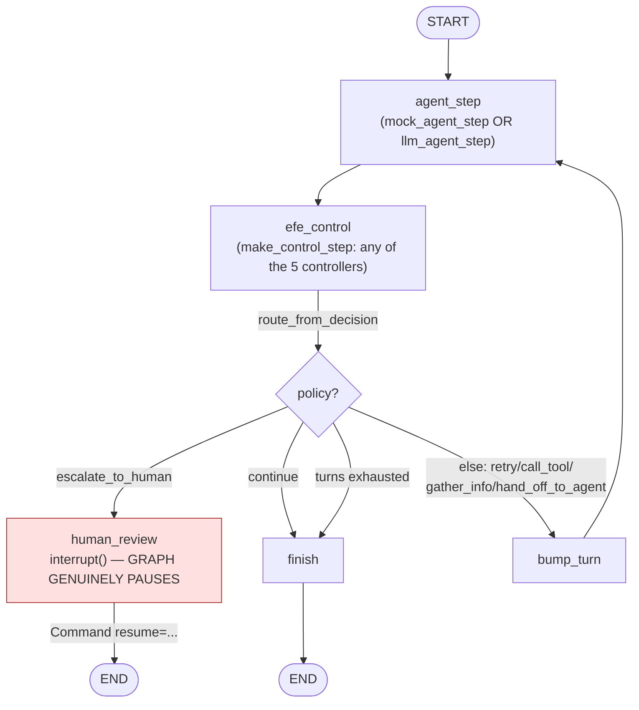

# LangGraph integration

Deep dive into `src/aif_orchestrator/graph.py` — Stage 1's actual
deliverable per `RESEARCH_PLAN.md`. This is the smaller, non-tau2
integration; see [`tau2-bench-integration.md`](tau2-bench-integration.md)
for the real-benchmark one. This one exists to prove the control-loop
plumbing works in isolation, cheaply, before touching the benchmark.

## The graph



This is the literal structure of `build_graph()` — every node and edge
above corresponds 1:1 to a `graph.add_node`/`graph.add_edge` call in the
code, not a simplification of it.

## The `escalate_to_human` → `interrupt()` proof

This is the one piece of infrastructure the whole project leans on, so
it's worth being precise about what "genuinely pauses" means here. It is
not simulated or mocked:

```python
app = build_graph()
result = app.invoke({...}, config={"configurable": {"thread_id": "task-B"}})

state = app.get_state(config)
if state.next:                      # non-empty => the graph is actually paused
    payload = state.tasks[0].interrupts[0].value   # what human_review_node passed to interrupt()
    # ... show payload to a real human, get their input ...
    result = app.invoke(Command(resume="Approved: ..."), config=config)
```

`human_review_node` calls `interrupt({...})`, which suspends the graph
mid-execution and persists full state via the `MemorySaver` checkpointer
passed to `graph.compile()`. `app.get_state(config).next` being non-empty
is the concrete, checkable proof the graph is paused, not finished —
`run_demo()`'s Task B exercises exactly this path and checks it. Resuming
with `Command(resume=...)` re-enters `human_review_node`, which returns
the injected feedback as `human_feedback` in state.

`MemorySaver` is in-memory only (fine for demos; a real deployment would
swap in a persistent checkpointer backend — same `interrupt()` call site,
different `compile(checkpointer=...)` argument).

## Pluggability: how a controller becomes a graph node

`make_control_step(control_node_cls, log_path)` is a factory, not a
fixed node — this is what let Stage 2's four baselines drop into the
exact same graph EFE runs in, with zero graph changes:

```python
efe_control_step = make_control_step()  # EFEControlNode, the default
heuristic_step   = make_control_step(HeuristicControlNode)
router_step      = make_control_step(LearnedRouterControlNode, log_path=STAGE2_DECISION_LOG_PATH)

app = build_graph(control_step=router_step)   # same graph structure, different brain
```

`run_stage2_demo()` (`python -m aif_orchestrator.graph --stage2`) proves
this for all 5 controllers, including the real `interrupt()` pause for
each — not just the fast statistical loop `baselines/run_stage2_eval.py`
uses for the 3000-episode comparison.

The same pattern applies to the *agent* side: `build_graph(agent_step=...)`
swaps `mock_agent_step` for `llm_agent_step` (`python -m
aif_orchestrator.graph --llm`) without touching the control-node side at
all. Agent step and control step are fully independent axes.

## State shape

```python
class OrchestratorState(TypedDict, total=False):
    task_id: str
    turn: int
    max_turns: int
    observation: dict       # tool_result/confidence/policy_gate/retrieval_quality
    belief: dict             # task_state belief, carried across turns
    last_policy: str
    done: bool
    human_feedback: str
    decision_trace: list     # accumulated per-turn decision records
    task_prompt: str          # real-agent only
    messages: list             # real-agent only: chat history across turns
```

`belief` round-trips as a `dict` (not the raw list `EFEControlNode`
works with internally) because LangGraph state needs to be serializable
across the checkpointer boundary — `make_control_step`'s `control_step`
converts back to a list (`list(state["belief"].values())`) when
constructing the next `control_node_cls(prior=...)`.

## Decision logging

Every `control_step` call appends one JSON record to `log_path`
(`results/stage1_decision_log.jsonl` by default, or
`results/stage2_decision_log.jsonl` for the baseline demo) — `task_id`,
`turn`, `controller`, the observation, the chosen policy, belief, and the
full `action_marginals`/`epistemic_value`/`pragmatic_value` breakdown per
candidate policy. This is append-only by design (a real running system
accumulates history, it doesn't overwrite it) — re-running a demo grows
the log rather than replacing it; if you need a clean comparison run,
start from a fresh file path.

## What this does *not* cover

This graph never talks to a real benchmark — `mock_agent_step` is a
hand-scripted stand-in, and `llm_agent_step`'s only tool is a fixed
2-entry fake order database. Its job is proving the control-loop
mechanics (routing, belief threading, the interrupt pause, pluggability)
work correctly in isolation. The real evaluation happens in
`tau2_integration/` — see
[`tau2-bench-integration.md`](tau2-bench-integration.md).
