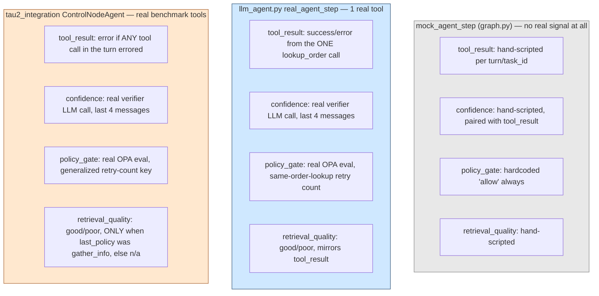

# Observation derivation

How the 4 observation modalities (`docs/decision-pomdp.md`) actually get
computed, across the three environments that produce them. This is worth
its own document because the three implementations differ in real,
consequential ways — not just boilerplate repeated three times.

## The 4 modalities, and their 3 sources



## Per-modality detail

### `tool_result`

- **mock**: hand-scripted per the task's story arc (`forced-bad-*` tasks
  always get `"error"`; otherwise a mostly-success trajectory with a
  30%-chance stumble after info-seeking actions).
- **`llm_agent.py`**: exactly `"success"` or `"error"` from the single
  `lookup_order` tool's real result (`_lookup_order`'s `found` field).
- **tau2**: `"error"` if *any* tool message in the incoming turn has
  `.error` set (handles `MultiToolMessage` — multiple parallel tool calls
  in one turn), else `"success"`; `"no_tool_called"` if the incoming
  message wasn't a tool result at all (plain user/assistant text).

### `confidence`

- **mock**: paired deterministically with the scripted `tool_result` —
  not a real signal, just consistent with the story.
- **`llm_agent.py`** and **tau2**: identical in structure — a second,
  separate LLM call rating the last 4 messages as `low`/`medium`/`high`,
  with a system-prompt instruction to reply with exactly one word. This
  is the cheaper of the two options flagged as an open design decision
  early in the project (the alternative, self-consistency sampling, costs
  N extra calls instead of 1). Deliberately built *without* the domain
  policy / system prompt in context — see
  [`tau2-bench-integration.md`](tau2-bench-integration.md)'s cost note.

### `policy_gate`

- **mock**: hardcoded `"allow"`, always — it has no real tool-call
  history to check a retry policy against, so wiring OPA here wouldn't be
  checking anything real (this is documented as an intentional
  simplification in `mock_agent_step`'s own docstring, not a gap).
- **`llm_agent.py`** and **tau2**: both call `opa_policy.evaluate_policy_gate()`,
  which shells out to a real `opa eval` against `policies/policy_gate.rego`.
  The only difference is the input key name: `llm_agent.py` originally
  used `same_order_lookup_count` (single-tool demo), later generalized to
  `same_tool_call_count` to match tau2's arbitrary-tool domains — both
  paths now use the generalized key.

### `retrieval_quality`

- **mock**: hand-scripted, loosely mirrors `tool_result`.
- **`llm_agent.py`**: mirrors `tool_result` directly (`"good"` on
  success, `"poor"` on error) — no distinction based on which policy was
  last taken, since the demo only has one tool.
- **tau2**: **only** meaningful — `"good"`/`"poor"` — when `state.last_policy
  == "gather_info"` (per `decision-pomdp.md`'s literal definition:
  "relevance of retrieved context, when `gather_info` was last taken");
  `"n/a"` for every other policy. This is the more faithful
  implementation of the schema's intent; `llm_agent.py`'s simpler version
  predates this refinement and was never backported since the demo's
  single-tool setup doesn't really exercise the distinction anyway.

## The OPA policy itself

`policies/policy_gate.rego` is deliberately small given the current tool
surface (only read-only lookups exist so far, nothing irreversible to
genuinely deny yet):

```rego
default decision := "allow"

decision := "deny" if {
    input.same_tool_call_count >= 3
} else := "needs_review" if {
    input.last_tool_result == "error"
} else := "allow"
```

A retry-loop circuit breaker (deny after 3+ identical repeats of the same
tool call, by name+arguments) plus a review flag on any tool error.
`opa_policy.evaluate_policy_gate()` fails safe to `"needs_review"` — not
`"allow"` — if OPA isn't installed or the policy errors, so a broken OPA
setup makes the system more conservative, never silently permissive.
Extend the `.rego` file, not the Python wrapper, when a domain needs
richer policies (e.g. tau2's retail/airline domains have genuinely
irreversible actions like refunds or cancellations worth a real `deny`
rule once that's a priority).

## Why this matters for interpreting results

Any comparison between `mock_agent_step`-based results and real-agent
results (`llm_agent.py` or tau2) needs to account for the fact that mock
observations carry **no real signal** — they're a fixed script, not a
sample from any assumed distribution. This is exactly why
[`stage2-baselines-results.md`](stage2-baselines-results.md) Part 1 is
explicitly labeled a plumbing check, not a decision-quality result, and
why Part 2 (`model_env.ModelMatchedEnv`) exists as the real comparison.
