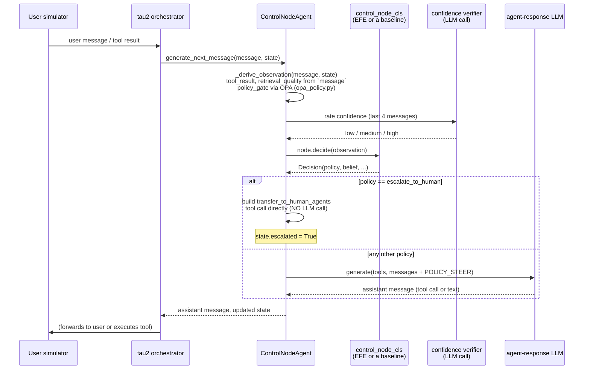
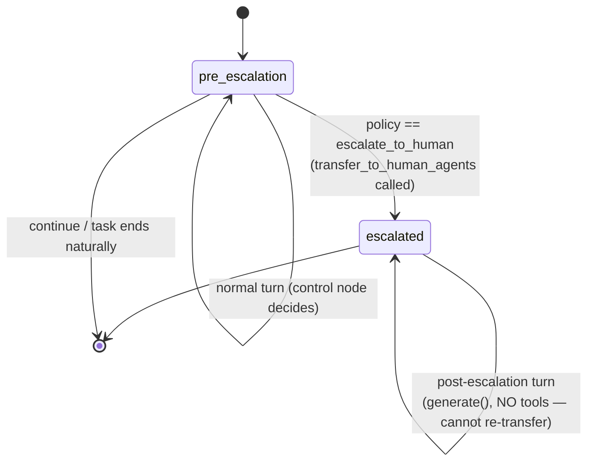

# tau2-bench integration

Deep dive into `src/aif_orchestrator/tau2_integration/` — Stage 3's real
benchmark wiring. `external/tau2-bench` (gitignored, not vendored) is
cloned and pinned at commit `a2c0247` (tagged release `tau2==1.0.1`;
`sierra-research/tau2-bench` — the "τ²-bench" `RESEARCH_PLAN.md` names is
now branded τ³-bench upstream, same repo/lineage). Editable-installed
into this project's own venv alongside `aif_orchestrator` so both are
importable in one process — see `context/TODOS.md`'s environment setup
section for the exact install steps (including the `audioop-lts`
backport Python 3.12+ needs for tau2's voice-module import chain).

## Why this integration matters more than `graph.py`'s

`graph.py`'s LangGraph demo proves the control-loop *mechanics* work.
This integration is where `escalate_to_human` stops being a demo pause
and becomes **a real, benchmark-scored action**: every core tau2 domain
(mock/retail/airline/telecom) has a built-in `transfer_to_human_agents(summary)`
tool, so EFE (or any baseline) choosing that policy makes the agent
genuinely call it — tau2's own evaluation criteria grade whether that was
the right or wrong call for the task. This is the first point in the
project where the escalation decision is judged by an external benchmark
rather than just pausing a graph.

## tau2's turn contract, and what that means for observation timing

tau2's `HalfDuplexAgent.generate_next_message(message, state)` splits
generation and tool execution across two calls: the agent proposes a
tool call, tau2's orchestrator executes it, and the **result** arrives as
the `message` argument on the **next** call — not the same call that
proposed it. So observation derivation happens at the *start* of each
turn, from what the *previous* turn's action produced, before generating
this turn's response. This mirrors how `llm_agent.py` derives its
observation only after a tool call resolves.



Two branches skip the normal path entirely: **turn 0** (nothing to
observe yet) and **any turn after `state.escalated` is set** (see below)
— both go straight to a plain `generate()` call, no observation
derivation, no control node.

## Two real bugs specific to this integration

**Turn-0 cold start.** `_derive_observation` on an empty conversation
would return `tool_result="no_tool_called"` — which the model reads as
50% evidence *for* `needs_human` (`TOOL_RESULT_DIST["needs_human"][3] ==
0.50`, the highest of any state for that bin), not "nothing has happened
yet". Verified: an early version genuinely escalated on turn 0, every
time, against tau2's mock domain. Fixed the same way `mock_agent_step`
avoids the identical trap (its own turn-0 special case): skip the control
loop entirely on a genuinely empty conversation and let the agent take
its first natural action unsupervised.

**`escalate_to_human` re-triggering.** Unlike `graph.py`'s `interrupt()`,
which actually halts execution, `transfer_to_human_agents` just returns a
normal `ToolMessage` — tau2 keeps calling `generate_next_message`
afterward. A control node whose belief/confidence stays poor after the
transfer (a real risk: a `tool_result="success"` nudges belief toward
`solvable`, but a noisy confidence-verifier call can pull it right back
toward uncertain) would keep re-escalating. Verified against a real
retail sweep: conversations with 2–7 `transfer_to_human_agents` calls
each, almost all scoring `reward=0.0`. Fixed: once `state.escalated` is
set, every later turn skips the control node entirely and calls
`generate()` **with no tools** — the model literally cannot call
`transfer_to_human_agents` (or anything else) again.



Both are cataloged with the rest of the project's bugs in
[`known-issues-and-gotchas.md`](known-issues-and-gotchas.md).

## What's shared across all 5 agents (and its cost implication)

`ControlNodeAgent` is generic over `control_node_cls` — `EFEAgent` and
the four baseline agents in `baseline_agents.py`
(`HeuristicAgent`/`RouterAgent`/`VOIAgent`/`ReActAgent`) are all *just*
`ControlNodeAgent` with that one class attribute swapped, registered
under `register.py`. This means **every one of the 5 agents pays the
confidence-verifier LLM call on every pre-escalation turn**, even
`HeuristicControlNode`/`ReActControlNode`, which don't meaningfully use
belief in their own decision logic — `_derive_observation` always derives
`confidence`, regardless of which control node consumes it. This is a
real, uniform cost across all 5 conditions, not just EFE/VOI/router — see
`scripts/estimate_stage3_cost.py`'s `CALL_SHAPES`, which models exactly
this.

The other real cost fact: `system_prompt` (`AGENT_INSTRUCTION` + the full
domain policy text) is sent in full on **every** `agent_response`/
`post_escalation_response` call (`state.system_messages + state.messages`)
— tau2's domain policies are known to run several thousand tokens, and
none of this project's LLM calls use prompt caching (the OpenAI-compatible
client via OpenRouter doesn't get Anthropic-style automatic caching). The
confidence-verifier call is deliberately built *without* the system
prompt (`_derive_confidence` constructs its own minimal message list) —
already cost-conscious, not an oversight.

## `register.py`: pre-training the router before any sweep

`register()` does one thing beyond registering the 5 agent factories:
it pre-trains `LearnedRouterControlNode` against `model_env.ModelMatchedEnv`
(100,000 episodes, ~2.5s, no LLM calls) *before* any `RouterAgent` gets
constructed. Without this, `RouterAgent`'s underlying router would
lazily self-train on first use with its class default — 10,000 episodes
against `graph.mock_agent_step`, the same mismatched stand-in
[`stage2-baselines-results.md`](stage2-baselines-results.md) Part 1
already flagged as "not a fair test of decision quality". See
[`baselines-design.md`](baselines-design.md)'s "Training data matters as
much as the algorithm" section for the full picture, and
[`known-issues-and-gotchas.md`](known-issues-and-gotchas.md) for this as
a caught-and-fixed item. Real tau2 dynamics are still not what either
training source actually models — this fix carries forward the *best
currently available* choice, not a claim of being calibrated to the real
benchmark.

## Running it

```bash
# 1-task sanity check, no real cost commitment
.venv/Scripts/python -m aif_orchestrator.tau2_integration.run_stage3_smoke

# Cost estimate BEFORE running anything larger (see scripts/estimate_stage3_cost.py)
.venv/Scripts/python scripts/estimate_stage3_cost.py --domain all --num-trials 1

# One domain, all 5 agents, 1 trial each — the real sweep, not yet run as of this writing
.venv/Scripts/python -m aif_orchestrator.tau2_integration.run_stage3_eval --domain retail
```

`run_stage3_eval.py` defaults to one domain at a time (not all three) —
278 tasks × 5 agents ≈ 1390 simulations across all three domains is the
real cost center `RESEARCH_PLAN.md`'s Stage 3 section warns about, so
checking one domain's results before committing to the rest is the
responsible default, not a limitation.
