# Testing and the end-to-end pipeline

How this project is verified, and what "verified" does and doesn't mean
here.

## The two entry points

```mermaid
flowchart LR
    subgraph FAST["pytest — seconds, no network"]
        T1["test_efe_controller.py<br/>engine + regression tests"]
        T2["test_baselines.py<br/>interface conformance x5"]
        T3["test_graph.py<br/>routing, interrupt/resume"]
        T4["test_observation_and_policy.py<br/>OPA fail-safe, schema"]
        T5["test_kill_test.py<br/>Stage 0.5 reproducibility"]
        T6["test_analysis.py<br/>the numbers-producing layer"]
        T7["test_cost_estimator.py<br/>spending-decision inputs"]
    end

    subgraph PIPE["run_full_pipeline.py — minutes, no network"]
        P0["Stage 0 sanity check"]
        PT["the whole test suite"]
        P05["Stage 0.5 kill-test (3000 eps x5)"]
        P1["Stage 1 LangGraph demo"]
        P2["Stage 2 plumbing (5 controllers)"]
        P22["Stage 2 Part 2 model-matched eval"]
        P3["Stage 3 cost estimate"]
    end

    subgraph BLOCKED["Needs network + credentials — never in CI"]
        B1["graph.py --llm (Stage 1c)"]
        B2["run_stage3_smoke.py"]
        B3["run_stage3_eval.py (costs money)"]
    end

    FAST --> PIPE
    PIPE -.cannot verify.-> BLOCKED

    style BLOCKED fill:#ffe0e0,stroke:#a33
```



```bash
pytest -q                                    # fast: unit + integration, no network
python scripts/run_full_pipeline.py          # everything reproducible offline
python scripts/run_full_pipeline.py --quick  # same, skipping the slow evaluations
```

`run_full_pipeline.py` writes `results/pipeline_run.json` with per-stage
pass/fail and the headline numbers from whichever result files the run
produced — so "does the whole thing still reproduce?" is one command and
one artifact, not a checklist someone has to remember to work through.

## What the tests actually protect

The bug archive (`known-issues-and-gotchas.md`) shows this project's
characteristic failure mode is **not** crashes — it's silent misreads
that produce a plausible-looking wrong decision. Nine of the eleven
catalogued bugs ran without raising anything. So the test suite leans
heavily on regression tests pinned to specific past bugs:

| Test | Pins bug |
|---|---|
| `test_correct_pymdp_package_is_installed` | #1 — wrong PyPI package, imports fine, wrong API |
| `test_efe_and_voi_agree_on_a_clearly_uncertain_belief` | #2 — lookahead double-counting that mimicked a real finding |
| `test_unnecessary_action_carries_a_cost` | #3 — EFE indifferent between `continue` and `gather_info` |
| `test_nonterminal_turns_do_not_pay_the_observation_reward` | #5 — router farming reward by never terminating |
| `test_escalation_is_rewarded_only_when_the_task_was_unresolvable` | #6 — no signal distinguishing correct escalation |
| `test_mock_agent_turn_zero_is_not_read_as_stuck` | #8 — turn-0 cold start read as "needs a human" |
| `test_router_can_be_retrained_against_the_model_matched_env` | #10 — silent fallback to mock-trained router |
| `test_fails_safe_to_needs_review_when_opa_is_unavailable` | policy engine down must not mean "allow" |

Plus structural invariants that would otherwise fail silently: every
probability row sums to 1, the frozen schema sizes match
`decision-pomdp.md`, every policy has a routing rule, and all five
controllers really are interchangeable (parametrized across the whole
suite rather than asserted in prose).

## What "verified" does not cover

Three things cannot be verified offline, and the docs never claim they
are:

1. **Real-LLM behavior** (`graph.py --llm`) — needs an API key and
   network.
2. **The tau2 integration** — `tau2_integration/` imports the `tau2`
   package at module level, so with `external/tau2-bench` absent those
   modules can't even be imported, let alone tested. The test suite
   deliberately does not stub `tau2`: a mock of a benchmark harness
   would verify the mock, not the integration.
3. **Anything costing money** — the Stage 3 sweep.

This is why `analysis/stage3_report.py`'s raw-dump reader carries an
explicit "never validated against real data" warning in its docstring,
its output, and its tests. The test pins the *expected* schema so a
mismatch surfaces as a test failure on first real contact rather than as
a wrong number in a report.

## CI

`.github/workflows/ci.yml`:

- **`test`** — the suite on Python 3.11 (declared floor) and 3.13 (dev
  venv), plus an explicit check that the correct `pymdp` resolved.
- **`pipeline`** — `run_full_pipeline.py --quick` on every PR.
- **`full-pipeline`** — the complete pipeline including the 3000-episode
  evaluations, nightly and on demand, uploading `results/` as an
  artifact. These are the runs that actually reproduce the numbers the
  result docs cite.
